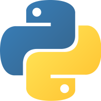

# Curso básico de Python

Este repositorio está enfocado en los aspectos básicos de Python

## Requisitos

Se puede dar click en el nombre de la tecnología para descargarlo en tu computadora.

-   [Python](https://www.python.org/) 3.9 en adelante
-   [Visual Studio Code](https://code.visualstudio.com/) o cualquier editor de texto
